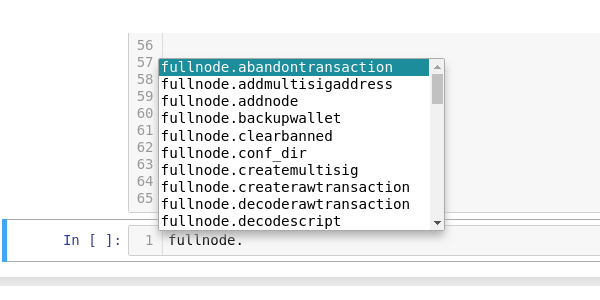

BitSV: Bitcoin SV made easy.
============================

Forked from Ofek's awesome Bit library: https://github.com/ofek/bit


[](https://pypi.org/project/bitsv)
[](https://travis-ci.org/AustEcon/bitsv)
[](https://codecov.io/gh/austecon/bitsv)
[](https://pypi.org/project/bitsv)
[](https://en.wikipedia.org/wiki/MIT_License)

Noticeboard:
------------
In the near-term I do not have the bandwidth to support any major increases in scope. If there are
features you'd like added, raise an issue for discussion. It may be that you're best to create your 
own small library that complements bitsv rather than allowing me to be a bottleneck...

Latest Major Release - [0.11.5](https://github.com/AustEcon/bitsv/blob/master/HISTORY.rst) (2021-01-24)

- Added WhatsOnChain API for mainnet and testnet
- Unspent data type: removed 'script' (scriptpubkey) attribute (unavailable from WhatsOnChain and Satoshi.io APIs and is unused in the codebase).
- Transaction, TxOutput, TxInput data types: removed unnecessary 'cruft' like 'amount_in', 'amount_out' and 'fee' (also to facilitate use of WhatsOnChain etc. and reduce maintenance overheads).
- MatterCloud now activated via **'MATTERCLOUD_API_KEY' environment variable** which makes it the highest priority API in the list for main, test, stn. Otherwise WhatsOnChain is used by default.
- 0.11.1 Fixed an off-by-one bug for generating pushdata op_codes for data-carrier 'op_return' txs - c/o [gitzhou](https://github.com/gitzhou).
- 0.11.2 NetworkAPI.broadcast_tx() now returns the txid instead of null.
- 0.11.3 Make 'prepare_transaction' a @classmethod as it should not require a private key (breaking change as function signature now requires the 'network' as a positional argument)
- 0.11.5 Update bchsvexplorer.com to bsvbook.guarda.co c/o `xloem <https://github.com/xloem>`_ and `kcentrifugal <https://github.com/kcentrifugal>`_
- 0.11.5 Extend test coverage to py38 and py39

Planned improvements
--------------------

- Improved coverage of testing modules (currently at 84%).
- Work on the bsvbip32 library for hierarchical deterministic keys:
  https://github.com/AustEcon/bsvbip32. Plan for each node to access
  bitsv functionality so that building apps can be a breeze!
  (competing implementations welcome. That's partly why modularity is a good idea!)

----------------------------

Examples
--------

**BitSV is so easy to use:**

1. Simple payment:

```
    >>> import bitsv
    >>> my_key = bitsv.Key('YourPrivateKeyGoesHere')  # Defaults to "main" network
    >>> my_key.get_balance()
    10000000  # satoshis
    >>> # Can include a long list of tuples as outputs
    >>> outputs = [
    >>>     # Donate to AustEcon! (Currency conversion via api)
    >>>     ('1PdvVPTzXmo4cSs68HctLUxAdW917UZtC8', 0.10, 'usd'),  # $USD 0.10 as bsv
    >>>     ('1PdvVPTzXmo4cSs68HctLUxAdW917UZtC8', 0.0001, 'bsv')
    >>> ]
    >>> my_key.send(outputs)
    'dec895d1aa0e820984c5748984ba36854163ec3d6847c94e82a921765c5b23e1'
```

Here's the transaction https://whatsonchain.com/tx/dec895d1aa0e820984c5748984ba36854163ec3d6847c94e82a921765c5b23e1.

2. OP_RETURN - 100kb size limit now supported:

```
    >>> import bitsv
    >>> my_key = bitsv.Key('YourPrivateKeyGoesHere')
    >>> list_of_pushdata = ([bytes.fromhex('6d01'),  # encode hex to bytes
                             'New_Name'.encode('utf-8')])  # encode string to utf-8 encoded bytes
    >>> my_key.send_op_return(list_of_pushdata)  # default fee = 1 sat/byte
```

This sets memo.sv name (linked to this bitcoin address) to "New_Name" (as per https://memo.sv/protocol)

3. Connect to a local 'fullnode' via JSON-RPC:

```
    >>> from bitsv import Fullnode
    >>> fullnode = FullNode(
            conf_dir='/home/username/.bitcoin/regtest.conf',
            rpcuser='user',
            rpcpassword='password',
            network='regtest')
```

Possible use cases may include:

    - Rapid transaction broadcasting ~ 200tx/sec):
    - Regtesting of app in AzurePipelines or Travis CI for example.
    - Learning / reproducing "too-long-mempool-chain" type errors without waiting a long time for confirmations.

The fullnode object has a complete internal list of all JSON-RPC methods added to __dict__ for code completion and methods return appropriate
error messages:

[]

For more detailed examples of using the Fullnode class, see [README](https://github.com/AustEcon/bitsv/blob/master/bitsv/network/services/README.rst)

Features
--------

- Python's fastest available implementation (100x faster than closest library)
- 100kb OP_RETURN transactions made very simple
- Fully supports 21 different currencies via exchange rate API
- First class support for storing data in the blockchain
- Compressed public keys by default
- Multiple representations of private keys; WIF, PEM, DER, etc.
- Standard P2PKH transactions

Installation
------------

BitSV is distributed on `PyPI` as a universal wheel and is available on Linux/macOS
and Windows and supports Python 3.5+ and PyPy3.5-v5.7.1+. ``pip`` >= 8.1.2 is required.


    $ pip install bitsv  # pip3 if pip is Python 2 on your system.

Documentation
-------------
Docs are hosted by Github Pages and are automatically built and published by Travis after every successful commit to BitSV's master branch.


Credits
-------

- [ofek](https://github.com/ofek/bit)
- [teran-mckinney](https://github.com/sporestack/bitcash)
- [joshua Smith](https://github.com/joshua-s)
- [xloem](https://github.com/xloem)
