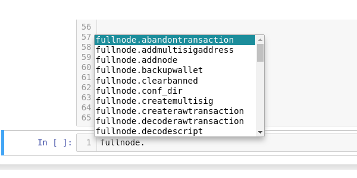

BitSV: Bitcoin SV made easy.
============================

Forked from Ofek's awesome Bit library: https://github.com/ofek/bit

.. image:: https://img.shields.io/pypi/v/bitsv.svg?style=flat-square
    :target: https://pypi.org/project/bitsv

.. image:: https://img.shields.io/travis/AustEcon/bitsv.svg?branch=master&style=flat-square
    :target: https://travis-ci.org/AustEcon/bitsv

.. image:: https://img.shields.io/codecov/c/github/AustEcon/bitsv.svg?style=flat-square
    :target: https://codecov.io/gh/austecon/bitsv

.. image:: https://img.shields.io/pypi/pyversions/bitsv.svg?style=flat-square
    :target: https://pypi.org/project/bitsv

.. image:: https://img.shields.io/badge/license-MIT-blue.svg?style=flat-square
    :target: https://en.wikipedia.org/wiki/MIT_License

Noticeboard:
------------
Latest Major Release - 0.11.1_ (2019-04-10)

.. _0.11.1: https://github.com/AustEcon/bitsv/blob/master/HISTORY.rst

- Added WhatsOnChain API for mainnet and testnet
- Unspent data type: removed 'script' (scriptpubkey) attribute (unavailable from WhatsOnChain and Satoshi.io APIs and is unused in the codebase).
- Transaction, TxOutput, TxInput data types: removed unnecessary 'cruft' like 'amount_in', 'amount_out' and 'fee' (also to facilitate use of WhatsOnChain etc. and reduce maintenance overheads).
- MatterCloud now activated via **'MATTERCLOUD_API_KEY' environment variable** which makes it the highest priority API in the list for main, test, stn. Otherwise WhatsOnChain is used by default.
- 0.11.1 Fixed an off-by-one bug for generating pushdata op_codes for data-carrier 'op_return' txs - c/o `gitzhou <https://github.com/gitzhou>`_.

Previous Major Release - 0.10.4_ (2019-02-13)

.. _0.10.4: https://github.com/AustEcon/bitsv/blob/master/HISTORY.rst

- Added new Fullnode class for connecting to local bitcoin node via JSON-RPC (thanks goes to https://github.com/xloem for the initial legwork).
- Fullnode class works for Mainnet, Testnet, Scaling-testnet and RegTest (local mock blockchain).
- Reordered outputs to always have 'false return' metadata included in the **first** output instead of the last. This will fix a new issue that arose with rendering of images etc. on bico.media.
- Prepend OP_FALSE to OP_RETURN in preparation for Genesis upgrade coming in February.
- Add 'sweep' function to PrivateKey class for sending all coins to a given address.
- 0.10.1 includes a patch for rpc methods list
- 0.10.2 includes a patch to fix broken API endpoint for foreign currency conversions.
- 0.10.3 allow transaction fee less than 1 sat/byte (i.e. float) c/o `gitzhou <https://github.com/gitzhou>`_
- 0.10.4 update main api url from https://api.bitindex.network to https://api.mattercloud.net

Planned improvements
--------------------

- Improved coverage of testing modules (currently at 84%).
- (Mostly done in 0.10.0) Support for use of a local bitcoin full node instead of a Web-API. (paves the way for a RegTest environment for a rapid development cycle)
- Work on the bsvbip32 library for hierarchical deterministic keys:
  https://github.com/AustEcon/bsvbip32. Plan for each node to access
  bitsv functionality so that building apps can be a breeze!
  (competing implementations welcome. That's partly why modularity is a good idea!)
- Add Whatsonchain API for added redundancy across main / test and stn networks.
- Minor updates to documentation for 0.9.0 release are still needed re: PrivateKey.get_transaction()

----------------------------

Examples
--------

**BitSV is so easy to use:**

1. Simple payment:

.. code-block:: python

    >>> import bitsv
    >>> my_key = bitsv.Key('YourPrivateKeyGoesHere')  # Defaults to "main" network
    >>> my_key.get_balance()
    10000000  # satoshis
    >>> # Can include a long list of tuples as outputs
    >>> outputs = [
    >>>     # Donate to AustEcon! (Currency conversion via api)
    >>>     ('1PdvVPTzXmo4cSs68HctLUxAdW917UZtC8', 0.10, 'usd'),  # $USD 0.10 as bsv
    >>>     ('1PdvVPTzXmo4cSs68HctLUxAdW917UZtC8', 0.0001, 'bsv')
    >>> ]
    >>> my_key.send(outputs)
    'dec895d1aa0e820984c5748984ba36854163ec3d6847c94e82a921765c5b23e1'

Here's the transaction `<https://whatsonchain.com/tx/dec895d1aa0e820984c5748984ba36854163ec3d6847c94e82a921765c5b23e1>`_.

2. OP_RETURN - 100kb size limit now supported:

.. code-block:: python

    >>> import bitsv
    >>> my_key = bitsv.Key('YourPrivateKeyGoesHere')
    >>> list_of_pushdata = ([bytes.fromhex('6d01'),  # encode hex to bytes
                             'New_Name'.encode('utf-8')])  # encode string to utf-8 encoded bytes
    >>> my_key.send_op_return(list_of_pushdata)  # default fee = 1 sat/byte

This sets memo.sv name (linked to this bitcoin address) to "New_Name" (as per https://memo.sv/protocol)

3. Connect to a local 'fullnode' via JSON-RPC:

.. code-block:: python

    >>> from bitsv import Fullnode
    >>> fullnode = FullNode(
            conf_dir='/home/username/.bitcoin/regtest.conf',
            rpcuser='user',
            rpcpassword='password',
            network='regtest')

note: wallet features of the node software will soon be deprecated. However, possible use cases may include

    - Rapid transaction broadcasting ~ 200tx/sec):
    - Regtesting of app in AzurePipelines or Travis CI for example.
    - Learning / reproducing "too-long-mempool-chain" type errors without waiting a long time for confirmations.

The fullnode object has a complete internal list of all JSON-RPC methods added to __dict__ for code completion and methods return appropriate
error messages:

For more detailed examples of using the Fullnode class, see README_

.. _README: https://github.com/AustEcon/bitsv/blob/master/bitsv/network/services/README.rst

Features
--------

- Python's fastest available implementation (100x faster than closest library)
- 100kb OP_RETURN transactions made very simple
- Fully supports 21 different currencies via exchange rate API
- First class support for storing data in the blockchain
- Compressed public keys by default
- Multiple representations of private keys; WIF, PEM, DER, etc.
- Standard P2PKH transactions

Installation
------------

BitSV is distributed on `PyPI` as a universal wheel and is available on Linux/macOS
and Windows and supports Python 3.5+ and PyPy3.5-v5.7.1+. ``pip`` >= 8.1.2 is required.

.. code-block:: bash

    $ pip install bitsv  # pip3 if pip is Python 2 on your system.

Documentation
-------------
Docs are hosted by Github Pages and are automatically built and published by Travis after every successful commit to BitSV's master branch.

Credits
-------

- `ofek`_ for the original bit codebase.
- `teran-mckinney`_ for his work on the bitcash fork
- `joshua smith`_ for adding BitIndex3
- `xloem`_ for help with adding Fullnode connectivity

.. _ofek: https://github.com/ofek/bit
.. _teran-mckinney: https://github.com/sporestack/bitcash
.. _joshua Smith: https://github.com/joshua-s
.. _xloem: https://github.com/xloem

Donate
--------

- If you have found this library useful, please consider donating. It really helps.
- HandCash: $AustEcon
- 1PdvVPTzXmo4cSs68HctLUxAdW917UZtC8
